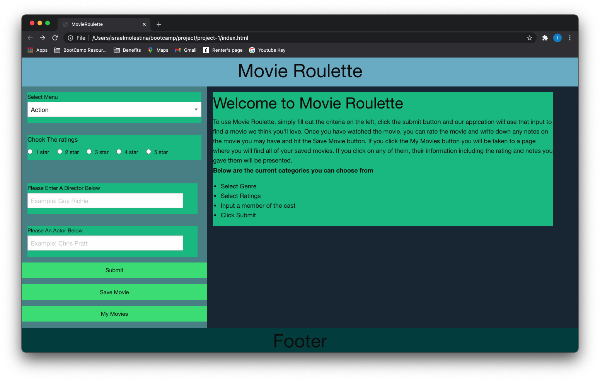
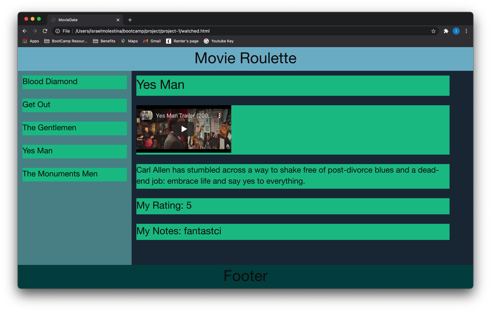

# Movie Roulette

## The Application

Movie Roulette is an application that allows the user to input criteria depending on what kind of movie they are in the mood for. The application then uses the user criteria and calls The Movie Data Base API to fetch a random movie. The user is presented with the title, description and trailer or poster of the movie. The user can then input their own rating for the movie and any notes they have on it and save that movie to their own list of watched movies. The user can then navigate to their list of watched movies and see details about the movies including what rating and notes they had given it.

## Concept

In this day and age, we are constantly being overwhelmed with decisions. You get up in the morning and immediately are faced with what to wear and what to eat. You get in your car for your morning commute and have thousands of options from songs to podcasts listen to. You go to a restaurant and the menus have 100's of items to choose from. Even our streaming apps contain hundreds and thousands of options for shows and movies. Gone are the days of cable and dish, and while we do not advocate that cable was better than Netflix, at least someone else had to decide what movie would play at what time. With our application, we hope to relieve some of that stress and decision fatigue from everyday movie lovers. Instead of spending 30 plus minutes choosing from thousands of movies, you simply tell the app what kind of movie you are in the mood for and let the app do the rest.

## User Story

AS an indecisive movie lover, I WANT to be presented with a random movie based on my own criteria, SO I don't waste my time looking for a movie.

## Process

### Technologies used

* JavaScript

* Foundation CSS

* The Movie Data Base API

* Google YouTube API

### Task breakdown and roles

#### Chinedu

* UI Layout and Design

* Retrieving movie info from API requests and displaying them on webpage

* Creating If statements for failed API requests

#### Israel

* API research/deployment

* Pulling user criteria and running them through our API's

* Saving user movie rating and notes to local storage and displaying them on watched movie page

### Challenges

* Figuring out how the Google YouTube API works

* How to properly use git

### Successes

* Finding new ways to work with JavaScript to get the results we wanted i.e: running if statements when user did not select all the criteria and when our fetch results did not bring back a trailer

## Future Development

* Implementing new criteria for user to input

* Cleaning up the UI

* Creating user accounts instead of storing to local storage

* Presenting user with streaming options

## Below is the link to the finished application along with some screenshots

### [Movie Roulette](https://israel-molestina.github.io/Movie-Roulette/)

### Intro Page

### Generated Movie

### MyMovies Page

